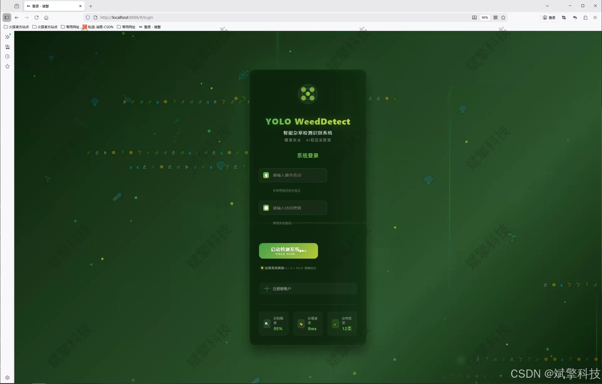
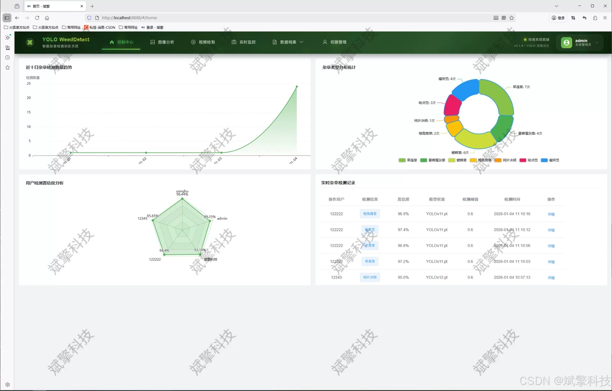
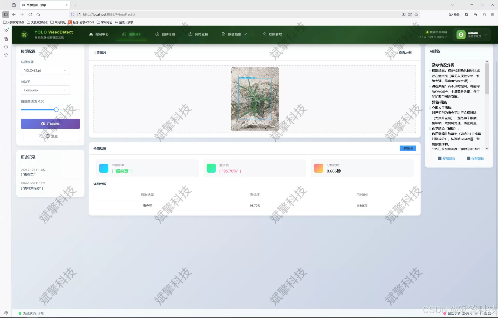
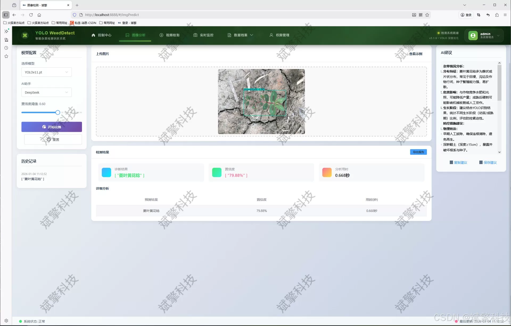
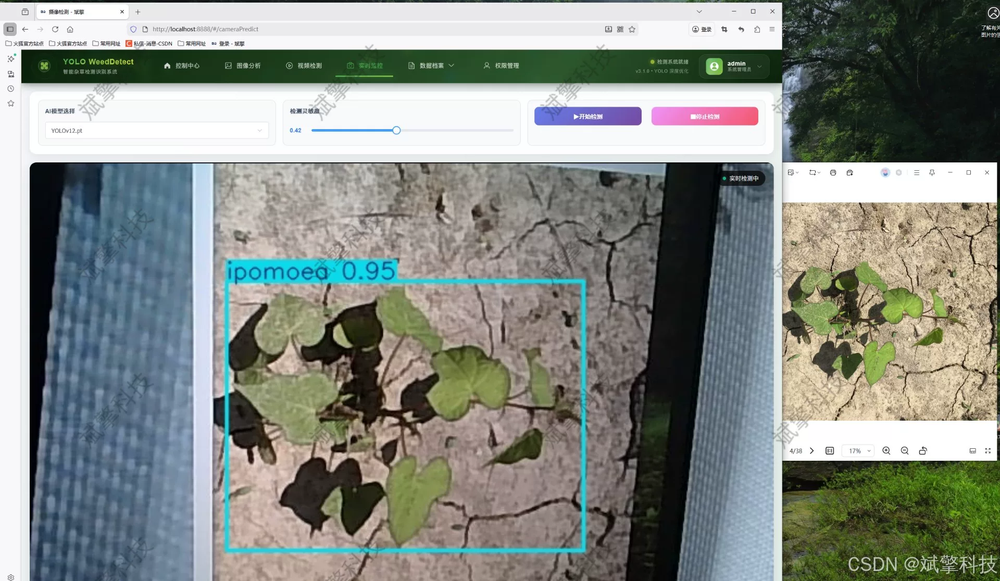
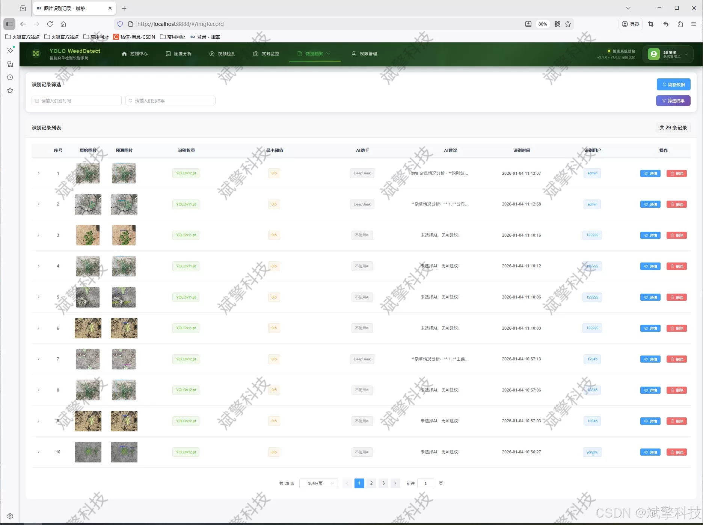
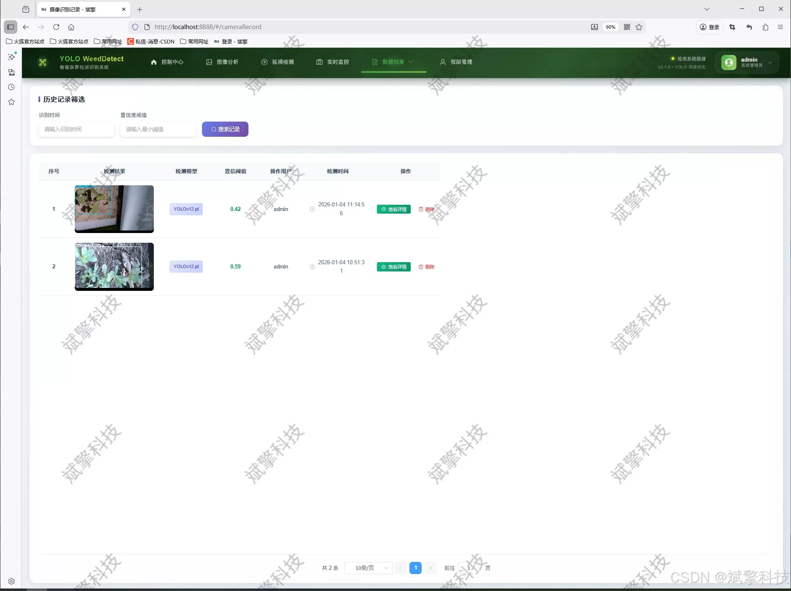
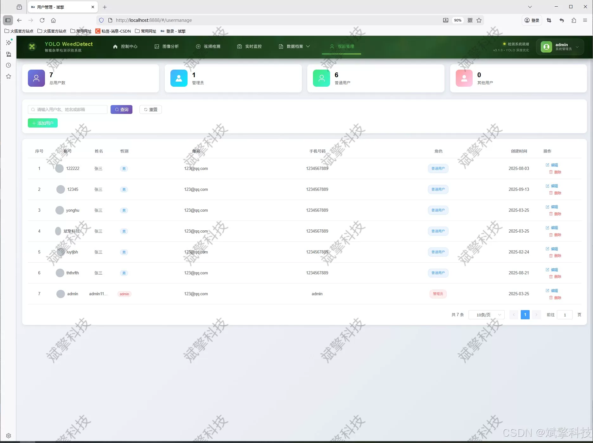
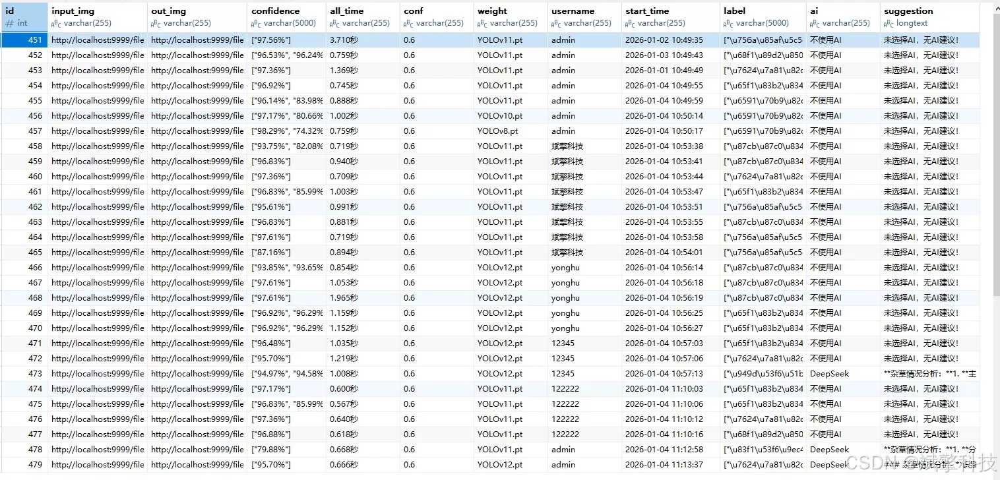

# YOLO weed detection

## Body

Yolo weed detection system based on YOLO deep learning and big models of Qianwen and DeepSeek (DeepSeek intelligent analysis + web interaction interface + front-end and back-end separation + YOLO data + YOLOv8/YOLOv10/YOLOv11/YOLOv12)

The project has designed and implemented a modern intelligent agricultural system that integrates efficient weed detection, intelligent analysis, and comprehensive management. The core of the system adopts the current advanced target detection algorithm series, integrating four models: YOLOv8, YOLOv10, YOLOv11, and YOLOv12. It builds a flexible and high-performance detection engine for precise identification of 12 common weeds (including Eclipta, Ipomoea, Eleusine, etc.). The backend is built using the SpringBoot framework to implement a RESTful API, achieving a separation between frontend and backend architecture; the frontend uses modern Web technology to construct an interactive interface and deeply integrates with a MySQL database for data persistence.

The system is comprehensive in functionality, supporting real-time detection of weeds through image, video, and camera feeds. It stores all detection records (including recognition time, target category, confidence level, and image path) in a structured format. Innovatively, the DeepSeek large language model is introduced for AI-powered analysis, providing users with extended knowledge interpretations on recognition results. Additionally, the system has built a complete user permission management system, including user registration and login, personal information maintenance, and exclusive admin functions such as user management and recognition record management. The data visualization module intuitively displays detection statistics and user behavior data, aiding decision-making. This research verifies the feasibility, high accuracy, and good user experience of the system in practical application scenarios, providing a complete solution for digitalization and intelligence in precision agriculture and plant protection fields.

Functional module

✅ User Login and Registration: Supports password detection, saves to MySQL database.

✅ Supports four YOLO model switches, YOLOv8, YOLOv10, YOLOv11, YOLOv12.

✅ Information Visualization, Data Visualization.

✅ Image detection supports AI analysis functions, deepseek and Qianwen.

✅ Supports image detection, video detection, and real-time camera detection. The results are saved to a MySQL database.

✅ Picture recognition record management, video recognition record management and camera recognition record management.

✅ User Management Module, administrators can add, delete, modify, and query users.

✅ Personal center, can modify their own information, password name profile picture and so on.

There is no Lunwen writing service, nor any Lunwen.

## Images

## Payment

Here is a pay link on Stripe ( https://buy.stripe.com/3cs8yP7sY87d0vu9AB ). Please contact me lonlonago@foxmail.com after funding $89, and I will send you a complete data files , thank you!

